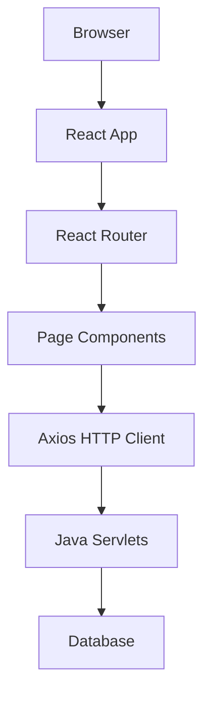
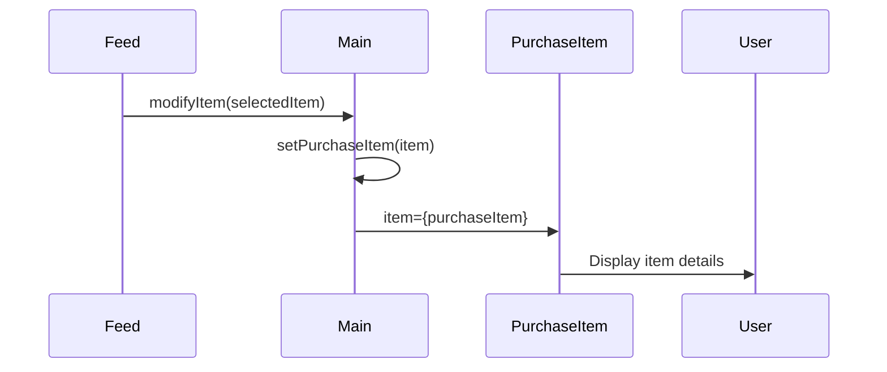

## Overview

Trojan Marketplace is built using a **client-server architecture** with a React frontend and Java servlet backend.



## Tech Stack

### Frontend
- **React 18.2.0** - Component-based UI library
- **React Router DOM 6.10.0** - Client-side routing
- **Styled Components 5.3.9** - CSS-in-JS styling
- **Axios 1.3.6** - Promise-based HTTP client
- **React Scripts 5.0.1** - Build tooling via Create React App

### Backend
- **Java Servlets** - Server-side request handling
- **Apache Tomcat 9.0+** - Servlet container
- **Database** - Data persistence layer

## Application Entry Point

The application bootstraps through three key files:

### index.js - React Root

From `index.js:1-13`, the app initializes with React 18's createRoot API:

```jsx index.js
import React from 'react';
import ReactDOM from 'react-dom/client';
import './index.css';
import App from './App';
import { BrowserRouter } from 'react-router-dom';

const root = ReactDOM.createRoot(document.getElementById('root'));
root.render(
  <BrowserRouter>
    <App />
  </BrowserRouter>
);
```

<Note>
  The `BrowserRouter` wrapper enables client-side routing throughout the application.
</Note>

### App.js - Application Shell

From `App.js:1-13`, the App component is a simple wrapper:

```jsx App.js
import './App.css';
import Main from './Main';

function App() {
  return (
    <div className="App">
      <Main/>
    </div>
  );
}

export default App;
```

### Main.js - Routing & Layout

From `Main.js:1-69`, Main handles routing and shared layout:

```jsx Main.js
import React, { useState, useEffect } from "react";
import styled from "styled-components";
import { Routes, Route } from "react-router-dom";
import Navbar from "./Navbar";
import Home from "./Home";
import Login from "./Login";
// ... other imports

const Main = (props) => {
  const [purchaseItem, setPurchaseItem] = useState({});
  const [loggedIn, setLoggedIn] = useState(false);
  
  function modifyItem(item) {
    setPurchaseItem(item);
  }
  
  function logIn() {
    setLoggedIn(true);
  }

  return (
    <StyledMain>
      <Navbar loggedIn={loggedIn}></Navbar>
      <Background></Background>
      <Routes>
        <Route exact path="/" element={<Home />}></Route>
        <Route exact path="/login" element={<Login logIn={logIn} />}></Route>
        <Route exact path="/profile" element={<Profile />}></Route>
        <Route exact path="/feed" element={<Feed modifyItem={modifyItem} />}></Route>
        <Route exact path="/message" element={<Message item={purchaseItem} />}></Route>
        <Route exact path="/create-sale" element={<CreateSale />}></Route>
        <Route exact path="/purchase-item" element={<PurchaseItem item={purchaseItem} />}></Route>
        <Route exact path="/create-account" element={<CreateAccount />}></Route>
      </Routes>
    </StyledMain>
  );
};
```

## State Management

The application uses **React's built-in state management** with hooks:

### Local Component State

Most components manage their own state using `useState`:

```jsx
// From Login.js:70-72
const [username, setUsername] = useState("");
const [password, setPassword] = useState("");
const [error, setError] = useState("");
```

### Prop Drilling

State is passed down through props from `Main.js`:

- **loggedIn** - Authentication status passed to Navbar (Main.js:26)
- **purchaseItem** - Selected item passed to Message and PurchaseItem (Main.js:15-18)
- **modifyItem** - Function to update selected item (Main.js:17-19)
- **logIn** - Function to update auth status (Main.js:20-22)

<Note>
  For larger applications, consider using Context API or state management libraries like Redux.
</Note>

## Routing Architecture

### Route Configuration

From `Main.js:28-49`, the app uses React Router v6:

| Route | Component | Purpose |
|-------|-----------|--------|
| `/` | Home | Landing page with welcome message |
| `/login` | Login | User authentication |
| `/create-account` | CreateAccount | New user registration |
| `/feed` | Feed | Browse marketplace listings |
| `/profile` | Profile | View user profile and history |
| `/create-sale` | CreateSale | List new item for sale |
| `/purchase-item` | PurchaseItem | Complete purchase transaction |
| `/message` | Message | Communicate with sellers |

### Navigation Pattern

Components use `useNavigate` hook for programmatic navigation:

```jsx
// From Feed.js:4-9
import { useNavigate } from "react-router-dom";

function Feed({ modifyItem }) {
  const navigate = useNavigate();
  
  function handlePurchase(index) {
    modifyItem(items[index]);
    navigate("/purchase-item");
  }
}
```

### Declarative Navigation

Navbar uses `Link` components from `Navbar.js:103-125`:

```jsx
import { Link } from "react-router-dom";

<Link className="nav-link" to="/feed">Feed</Link>
<Link className="nav-link" to="/profile">Profile</Link>
<Link className="nav-link" to="/create-sale">Create Sale</Link>
```

## Component Architecture

### Component Hierarchy

```text
App
└── Main
    ├── Navbar (persistent)
    ├── Background (styled component)
    └── Routes
        ├── Home
        ├── Login
        ├── CreateAccount
        ├── Feed
        ├── Profile
        ├── CreateSale
        ├── PurchaseItem
        └── Message
```

### Component Patterns

#### Presentational Components

Components focused on UI rendering:

```jsx
// From Home.js:4-22
function Home() {
  return (
    <div className="container">
      <div className="image">
        
      </div>
      <div className="rectangles">
        <div className="rectangle">
          <h2>Welcome to the Trojan Marketplace</h2>
        </div>
      </div>
    </div>
  );
}
```

#### Container Components

Components that manage data and side effects:

```jsx
// From Feed.js:7-24
function Feed({ modifyItem }) {
  const [items, setItems] = useState([]);
  const navigate = useNavigate();

  useEffect(() => {
    const fetchData = async () => {
      try {
        const response = await axios.get(
          "http://localhost:8080/Final_Project/ItemFetchServlet"
        );
        setItems(response.data);
      } catch (error) {
        console.error("Error fetching data:", error);
      }
    };
    fetchData();
  }, []);
  
  // Render items...
}
```

#### Form Components

Components with controlled inputs and submission handlers:

```jsx
// From Login.js:75-101
const handleSubmit = async (event) => {
  event.preventDefault();
  
  try {
    const response = await axios.post(
      "http://localhost:8080/Final_Project/LoginServlet",
      `username=${encodeURIComponent(username)}&password=${encodeURIComponent(password)}`,
      {
        headers: {
          "Content-Type": "application/x-www-form-urlencoded",
        },
      }
    );
    
    if (response.data === true) {
      props.logIn();
      navigate("/feed");
    } else {
      setError("Invalid username or password");
    }
  } catch (error) {
    setError("An error occurred. Please try again.");
  }
};
```

## Layout System

### Persistent Elements

From `Main.js:25-27`, certain elements persist across routes:

1. **Navbar** - Always visible with conditional rendering based on `loggedIn` state
2. **Background** - Fixed USC-themed background image (Main.js:54-63)

```jsx
const Background = styled.div`
  position: fixed;
  top: 0;
  left: 0;
  width: 100%;
  height: 100%;
  background-image: url(https://pbs.twimg.com/media/EU8GlrJWsAAZKHx?format=jpg&name=large);
  background-size: cover;
  z-index: -1;
`;
```

### Conditional Navbar

From `Navbar.js:103-124`, navigation links change based on authentication:

```jsx
{loggedIn ? (
  <>
    <Link className="nav-link" to="/profile">Profile</Link>
    <Link className="nav-link" to="/create-sale">Create Sale</Link>
    <Link className="nav-link" to="/feed">Feed</Link>
  </>
) : (
  <>
    <Link className="nav-link" to="/login">Login</Link>
  </>
)}
```

## Data Flow

### Top-Down Data Flow

1. **Main** component holds shared state
2. State/functions passed as props to children
3. Child components call prop functions to update parent state
4. State changes trigger re-renders

Example flow for purchasing an item:



## Performance Considerations

### Code Splitting

The app uses React Router's lazy loading capability for route-based code splitting.

### Memoization

Consider using `React.memo`, `useMemo`, and `useCallback` for expensive computations:

```jsx
// Example optimization
const memoizedValue = useMemo(() => computeExpensiveValue(a, b), [a, b]);
```

## Next Steps

<CardGroup cols={2}>
  <Card title="Styling Guide" icon="palette" href="/development/styling">
    Learn about styled-components and CSS patterns
  </Card>
  <Card title="Backend Integration" icon="plug" href="/development/backend-integration">
    Understand API communication patterns
  </Card>
</CardGroup>