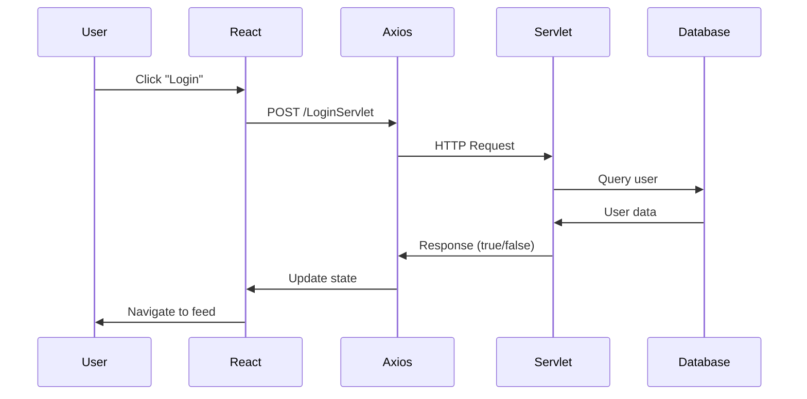

## Overview

Trojan Marketplace uses **Axios** for HTTP communication between the React frontend and Java servlet backend.



## Backend Configuration

### Base URL

All servlets are hosted at:
```
http://localhost:8080/Final_Project/
```

### Available Servlets

| Servlet | Method | Purpose |
|---------|--------|----------|
| `LoginServlet` | POST | Authenticate users |
| `CreateAccountServlet` | POST | Register new users |
| `ItemFetchServlet` | GET | Retrieve all marketplace items |
| `AddItemServlet` | POST | Create new item listings |

## Axios Setup

### Installation

From `package.json:9`, Axios is included:

```json
"axios": "^1.3.6"
```

### Import Pattern

From components that make API calls:

```jsx
import axios from "axios";
```

## API Integration Patterns

### GET Requests

#### Fetching Data on Component Mount

From `Feed.js:11-24`, fetch items when component loads:

```jsx Feed.js
import React, { useState, useEffect } from "react";
import axios from "axios";

function Feed({ modifyItem }) {
  const [items, setItems] = useState([]);

  useEffect(() => {
    const fetchData = async () => {
      try {
        const response = await axios.get(
          "http://localhost:8080/Final_Project/ItemFetchServlet"
        );
        setItems(response.data);
      } catch (error) {
        console.error("Error fetching data:", error);
      }
    };

    fetchData();
  }, []);
  
  return (
    <div>
      {items.map((item, index) => (
        <div key={index}>
          <h3>{item.item_name}</h3>
          <p>{item.item_description}</p>
          
        </div>
      ))}
    </div>
  );
}
```

<Note>
  The empty dependency array `[]` ensures the fetch runs only once when the component mounts.
</Note>

#### Expected Response Format

The servlet should return a JSON array of item objects:

```json
[
  {
    "item_name": "Space Heater",
    "item_description": "Gently used space heater",
    "image_url": "https://example.com/heater.jpg",
    "price": 50
  },
  {
    "item_name": "Textbook",
    "item_description": "CSCI 201 textbook",
    "image_url": "https://example.com/book.jpg",
    "price": 75
  }
]
```

### POST Requests

#### Login Authentication

From `Login.js:75-101`, POST with form data:

```jsx Login.js
import React, { useState } from "react";
import axios from "axios";
import { useNavigate } from "react-router-dom";

function Login(props) {
  const [username, setUsername] = useState("");
  const [password, setPassword] = useState("");
  const [error, setError] = useState("");
  const navigate = useNavigate();

  const handleSubmit = async (event) => {
    event.preventDefault();
    
    try {
      const response = await axios.post(
        "http://localhost:8080/Final_Project/LoginServlet",
        `username=${encodeURIComponent(username)}&password=${encodeURIComponent(password)}`,
        {
          headers: {
            "Content-Type": "application/x-www-form-urlencoded",
          },
        }
      );
      
      console.log(response.data);
      if (response.data === true) {
        props.logIn();
        navigate("/feed");
      } else {
        setError("Invalid username or password");
      }
    } catch (error) {
      console.error("Error during login request:", error);
      setError("An error occurred. Please try again.");
    }
  };
  
  return (
    <form onSubmit={handleSubmit}>
      <input
        type="email"
        value={username}
        onChange={(e) => setUsername(e.target.value)}
        required
      />
      <input
        type="password"
        value={password}
        onChange={(e) => setPassword(e.target.value)}
        required
      />
      <button type="submit">Log In</button>
      {error && <p style={{color: "red"}}>{error}</p>}
    </form>
  );
}
```

<Warning>
  Always use `encodeURIComponent()` when building URL-encoded form data to handle special characters properly.
</Warning>

#### Create Account

From `CreateAccount.js:81-109`, similar POST pattern:

```jsx CreateAccount.js
const handleSubmit = async (event) => {
  event.preventDefault();

  try {
    const response = await axios.post(
      "http://localhost:8080/Final_Project/CreateAccountServlet",
      `username=${encodeURIComponent(username)}&password=${encodeURIComponent(password)}`,
      {
        headers: {
          "Content-Type": "application/x-www-form-urlencoded",
        },
      }
    );

    if (response.data === true) {
      navigate("/login");
    } else {
      console.log("Account creation failed");
    }
  } catch (error) {
    console.error("Error during account creation:", error);
  }
};
```

#### Add Item Listing

From `CreateSale.js:20-45`, POST with multiple form fields:

```jsx CreateSale.js
import React, { useState } from "react";
import axios from "axios";
import { useNavigate } from "react-router-dom";

function CreateSale() {
  const [title, setTitle] = useState("");
  const [description, setDescription] = useState("");
  const [image, setImage] = useState("");
  const [price, setPrice] = useState("");
  const [error, setError] = useState("");
  const navigate = useNavigate();

  const handleSubmit = async (event) => {
    event.preventDefault();

    try {
      const response = await axios.post(
        "http://localhost:8080/Final_Project/AddItemServlet",
        `item_name=${encodeURIComponent(title)}&item_description=${encodeURIComponent(description)}&image_url=${encodeURIComponent(image)}&price=${encodeURIComponent(price)}`,
        {
          headers: {
            "Content-Type": "application/x-www-form-urlencoded",
          },
        }
      );
      
      navigate("/feed");
      console.log(response.data);
    } catch (error) {
      console.error("Error during item creation:", error);
      setError("An error occurred. Please try again.");
    }
  };
  
  return (
    <form onSubmit={handleSubmit}>
      <input
        type="text"
        value={title}
        onChange={(e) => setTitle(e.target.value)}
        placeholder="Item Title"
      />
      <textarea
        value={description}
        onChange={(e) => setDescription(e.target.value)}
        placeholder="Description"
      />
      <input
        type="text"
        value={image}
        onChange={(e) => setImage(e.target.value)}
        placeholder="Image URL"
      />
      <input
        type="text"
        value={price}
        onChange={(e) => setPrice(e.target.value)}
        placeholder="Price"
      />
      <button type="submit">Create Sale</button>
    </form>
  );
}
```

## Request/Response Patterns

### Content Type

All POST requests use URL-encoded form data:

```jsx
headers: {
  "Content-Type": "application/x-www-form-urlencoded",
}
```

### Building Request Body

From the codebase, the pattern for request bodies:

```jsx
// Single parameter
`username=${encodeURIComponent(username)}`

// Multiple parameters
`username=${encodeURIComponent(username)}&password=${encodeURIComponent(password)}`

// Complex form
`item_name=${encodeURIComponent(title)}&item_description=${encodeURIComponent(description)}&image_url=${encodeURIComponent(image)}&price=${encodeURIComponent(price)}`
```

<Note>
  This format is equivalent to how HTML forms submit data with `method="post"` and `enctype="application/x-www-form-urlencoded"`.
</Note>

### Response Handling

#### Boolean Responses

Login/CreateAccount servlets return boolean:

```jsx
if (response.data === true) {
  // Success case
} else {
  // Failure case
}
```

#### Array Responses

ItemFetchServlet returns array of objects:

```jsx
const response = await axios.get("...");
setItems(response.data);  // response.data is an array
```

## Error Handling

### Try-Catch Pattern

All API calls should use try-catch:

```jsx
try {
  const response = await axios.post(url, data, config);
  // Handle success
} catch (error) {
  console.error("Error message:", error);
  setError("User-friendly error message");
}
```

### Displaying Errors to Users

From `Login.js:133`, conditional error display:

```jsx
{error && <p style={{color: "red"}}>{error}</p>}
```

### Error State Management

```jsx
const [error, setError] = useState("");

// Clear error on successful request
if (response.data === true) {
  setError("");  // Clear any previous errors
  navigate("/feed");
} else {
  setError("Invalid credentials");
}
```

## Navigation After API Calls

### useNavigate Hook

From `Login.js:4` and `Login.js:73`, programmatic navigation:

```jsx
import { useNavigate } from "react-router-dom";

function MyComponent() {
  const navigate = useNavigate();
  
  const handleSubmit = async () => {
    const response = await axios.post(...);
    if (response.data === true) {
      navigate("/feed");  // Redirect on success
    }
  };
}
```

### Common Navigation Patterns

```jsx
// After successful login
navigate("/feed");

// After account creation
navigate("/login");

// After creating sale
navigate("/feed");

// After selecting item to purchase
navigate("/purchase-item");

// After selecting item to message about
navigate("/message");
```

## State Management with API Data

### Loading State

Implement loading indicators:

```jsx
const [items, setItems] = useState([]);
const [loading, setLoading] = useState(true);

useEffect(() => {
  const fetchData = async () => {
    setLoading(true);
    try {
      const response = await axios.get(url);
      setItems(response.data);
    } catch (error) {
      console.error(error);
    } finally {
      setLoading(false);
    }
  };
  fetchData();
}, []);

if (loading) return <div>Loading...</div>;
```

### Passing API Data Between Routes

From `Feed.js:26-33`, pass data through navigation:

```jsx
function Feed({ modifyItem }) {
  const navigate = useNavigate();
  const [items, setItems] = useState([]);
  
  function handlePurchase(index) {
    modifyItem(items[index]);  // Update parent state
    navigate("/purchase-item");  // Navigate to purchase page
  }
}
```

The receiving component gets the data via props:

```jsx
// In Main.js routing
<Route path="/purchase-item" element={<PurchaseItem item={purchaseItem} />} />

// In PurchaseItem.js
function PurchaseItem({ item }) {
  return (
    <div>
      <h1>{item.item_name}</h1>
      <p>{item.item_description}</p>
      <p>${item.price}</p>
    </div>
  );
}
```

## CORS Configuration

### Backend Setup

Your servlet backend must allow CORS from the React dev server:

```java
// In your servlet's doGet/doPost methods
response.setHeader("Access-Control-Allow-Origin", "http://localhost:3000");
response.setHeader("Access-Control-Allow-Methods", "GET, POST, OPTIONS");
response.setHeader("Access-Control-Allow-Headers", "Content-Type");
```

### Production Considerations

<Warning>
  In production, replace `http://localhost:3000` with your actual domain and never use `*` for `Access-Control-Allow-Origin` in production.
</Warning>

## Testing API Integration

### Console Logging

From the codebase, using console.log for debugging:

```jsx
console.log(response.data);  // Log response
console.error("Error message:", error);  // Log errors
```

### Browser DevTools

<Steps>
  <Step title="Open Network tab">
    Open browser DevTools and go to the Network tab
  </Step>
  
  <Step title="Filter XHR requests">
    Filter by XHR to see only Axios requests
  </Step>
  
  <Step title="Inspect requests">
    Click on a request to see:
    - Headers
    - Request payload
    - Response data
    - Status code
  </Step>
</Steps>

## Common Issues and Solutions

### Issue: CORS Error

**Symptom:** `Access to XMLHttpRequest blocked by CORS policy`

**Solution:** Configure CORS headers in your servlets (see CORS Configuration above)

### Issue: 404 Not Found

**Symptom:** Servlet not found

**Solution:** 
- Verify Tomcat is running on port 8080
- Check servlet URL mapping
- Ensure project name is `Final_Project`

### Issue: Empty Response

**Symptom:** `response.data` is undefined or null

**Solution:**
- Check servlet is setting `Content-Type: application/json`
- Verify servlet is writing to response output stream
- Check servlet logic returns data

### Issue: Form Data Not Received

**Symptom:** Servlet receives null parameters

**Solution:**
- Use `encodeURIComponent()` for all values
- Set correct `Content-Type` header
- Verify parameter names match servlet expectations

## Best Practices

<Check>Always use async/await for Axios calls</Check>
<Check>Wrap API calls in try-catch blocks</Check>
<Check>Use encodeURIComponent for URL-encoded data</Check>
<Check>Set appropriate Content-Type headers</Check>
<Check>Display user-friendly error messages</Check>
<Check>Log errors to console for debugging</Check>
<Check>Implement loading states for better UX</Check>
<Check>Clear error states on successful requests</Check>
<Check>Navigate programmatically after successful operations</Check>
<Check>Validate data before sending to backend</Check>

## Next Steps

<CardGroup cols={2}>
  <Card title="API Reference" icon="code" href="/api/authentication">
    Detailed API endpoint documentation
  </Card>
  <Card title="Components" icon="cube" href="/components/feed">
    See components that use API integration
  </Card>
</CardGroup>